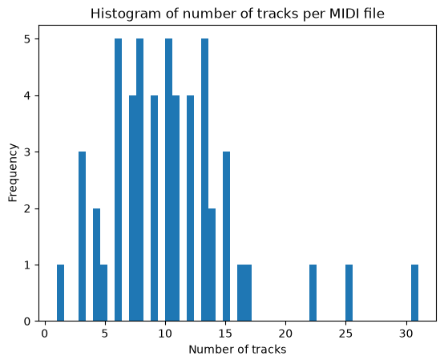
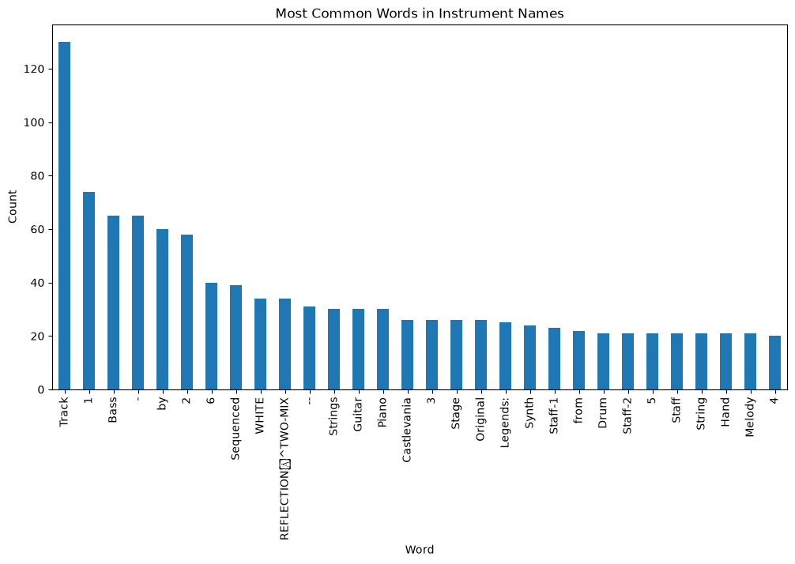
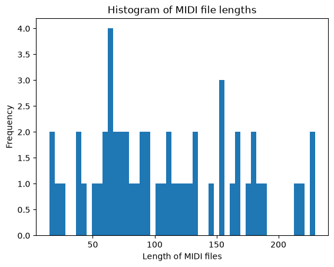
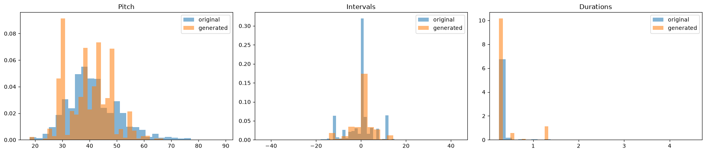
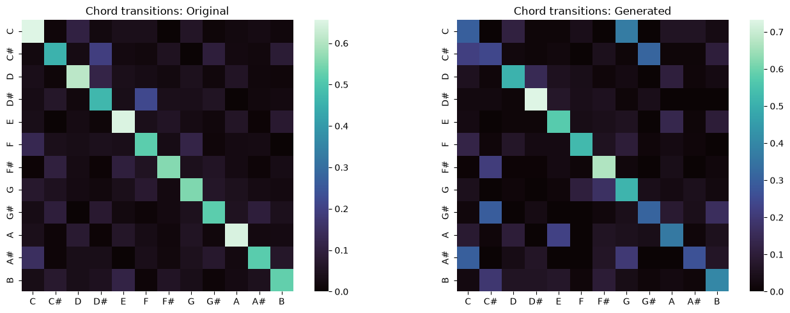
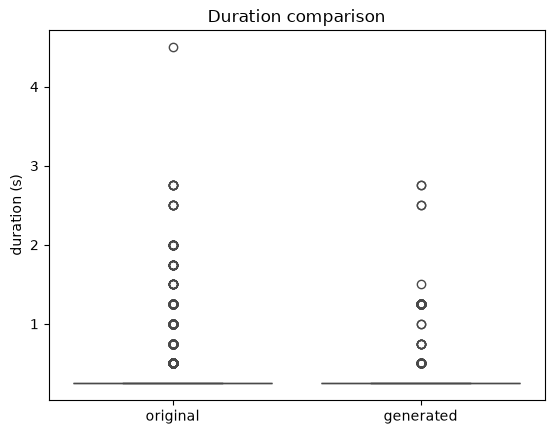

# Third degree Markov model for generating bass lines for video game soundtracks

### Dataset

Source: [hansespinosa2 - 30000 Video Game MIDI Files](www.kaggle.com/datasets/hansespinosa2/40000-video-game-midi-files/data)

### Project structure

* Analysis, model creation and file generation - [project.ipynb](project.ipynb)
* Package requirements - [requirements.txt](requirements.txt)
* Dataset download - [download_data.py](download_data.py)

### Theoretical basis

A Markov model is a

### Training dataset

### Dataset preprocessing

The MIDI files were mostly composed of more than one track and instrument.

An analysis of the most common instrument to do the training and generation for was done by splitting all instrument names in all MIDI files and analyzing the unique word histogram. Only the words which were present more  than 20 times are shown:

Since bass was the most common instrument name on the histofram, it was decided to create a Markov model to generate bass lines from the dataset.
An important part was also to make sure the files didn't have some outliers. One way of making sure was looking at the hsitogram of MIDI file durations:

From here it was decided to remove the files with duration longer than 200 seconds.

* After preprocessing there are **49** valid MIDI files for model training.*

### Model creation

Events which were created:

* pitch
* duration
* onset gap
* chord

Number of states: 234
Number of tokens: 17253

Number of contexts per order: {1: 234, 2: 1243, 3: 2297}

Two bass lines with MIDI files were create for each temperature in the list: [0.5, 0.7, 0.9, 1, 1.15, 1.5]

### Model evaluation

<table border="1" class="dataframe">
  <thead>
    <tr style="text-align: left;">
      <th>Group</th>
      <th>Pitch entropy</th>
      <th>Interval entropy</th>
      <th>Duration entropy</th>
      <th>3-gram Jaccard</th>
    </tr>
  </thead>
  <tbody>
    <tr>
      <td>Original</td>
      <td>5.117</td>
      <td>3.389</td>
      <td>0.364</td>
      <td>1.000</td>
    </tr>
    <tr>
      <td>Generated</td>
      <td>4.634</td>
      <td>3.315</td>
      <td>0.829</td>
      <td>0.188</td>
    </tr>
  </tbody>
</table>

<style scoped>
    .dataframe tbody tr th:only-of-type {
        vertical-align: middle;
    }

<style scoped>
    .dataframe tbody tr th:only-of-type {
        vertical-align: middle;
    }

### Subjective comparison
