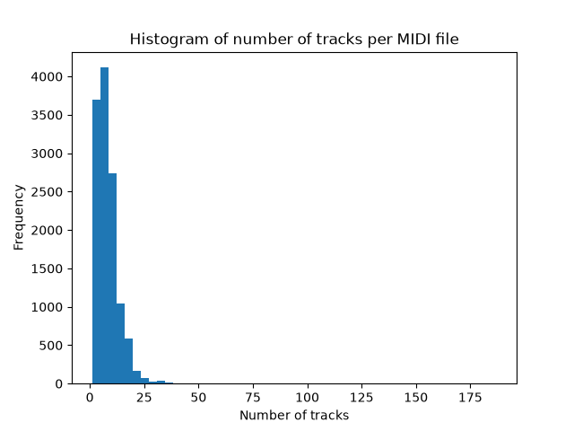
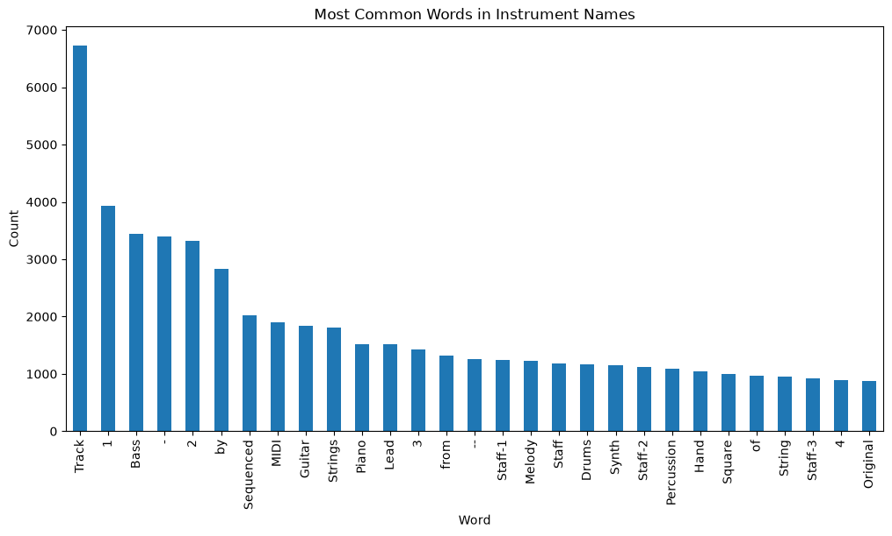
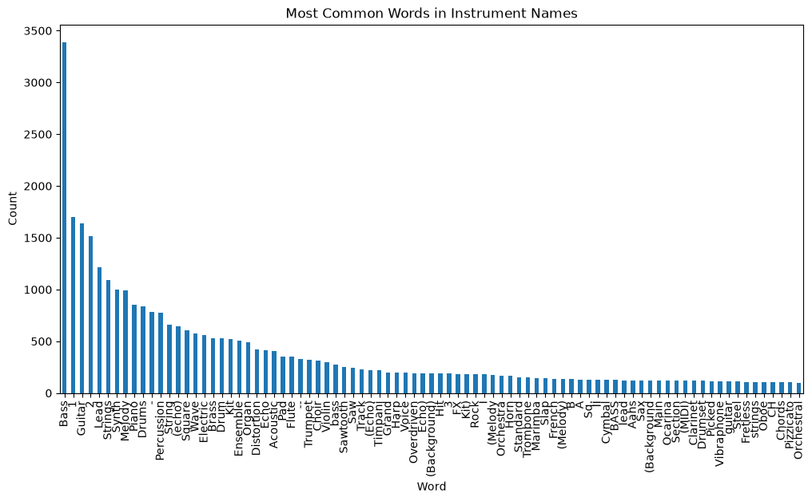
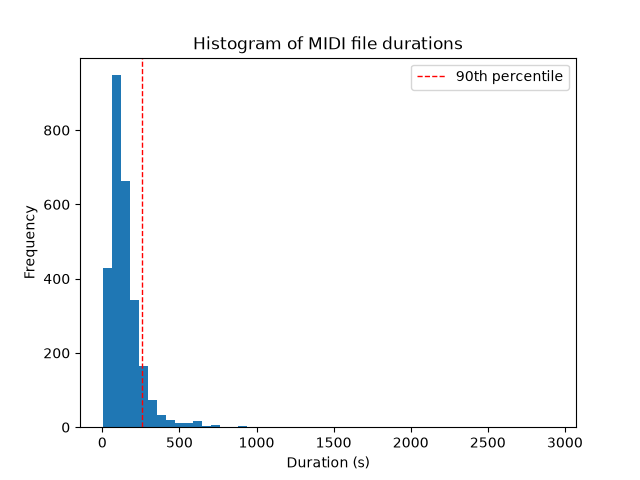
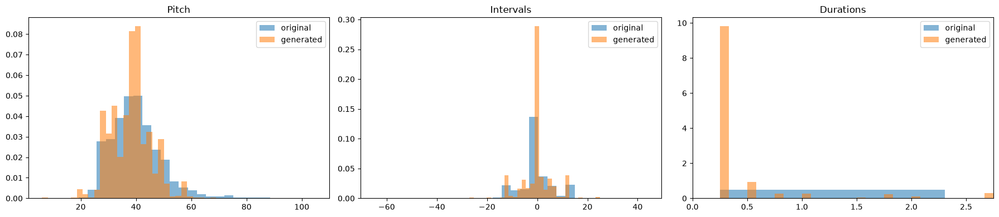
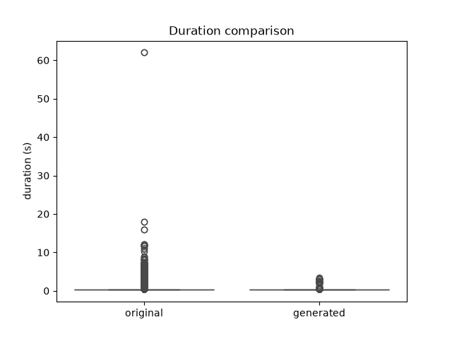
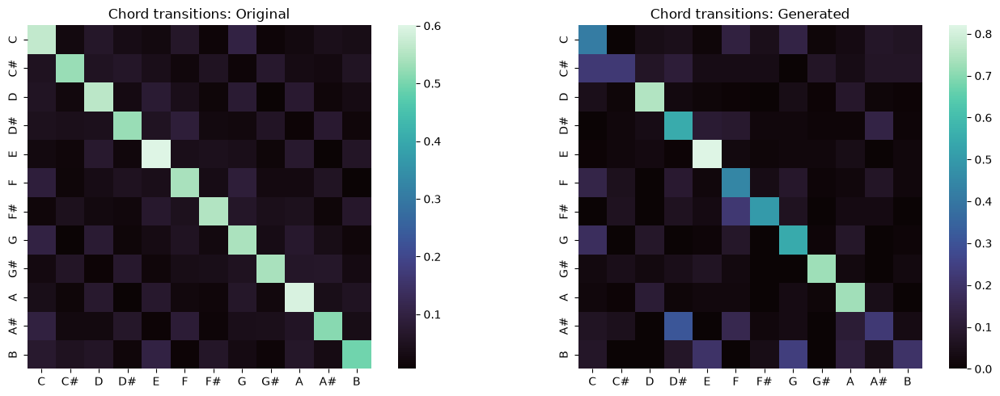
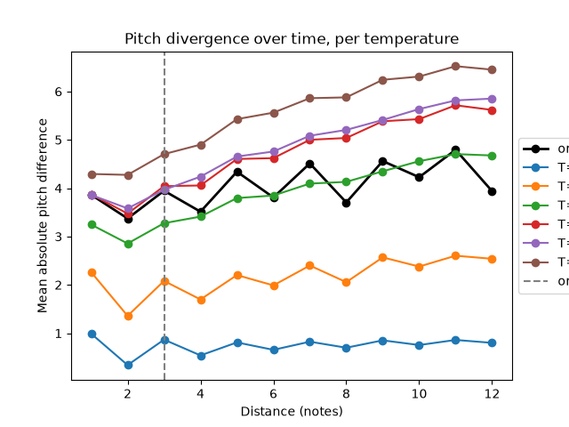
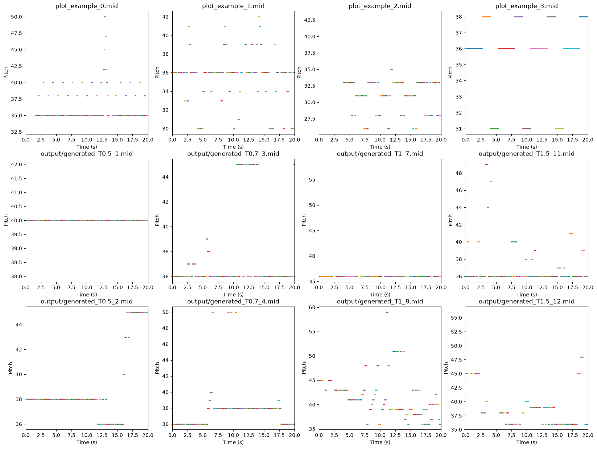

# Third order Markov model for generating bass lines for video game soundtracks

## Dataset

Source: [hansespinosa2 - 30000 Video Game MIDI Files](https://www.kaggle.com/datasets/hansespinosa2/40000-video-game-midi-files/data)

## Project structure

* Analysis, model creation and file generation - [project.ipynb](project.ipynb)
* Package requirements - [requirements.txt](requirements.txt)
* Dataset download - [download_data.py](download_data.py)

## Theoretical basis

### Music representation

Unlike audio formats which store recorded audio directly, MIDI  files store instructions for producing music. Events are described such as note-on, note-off, pitch, velocity, timing, tempo, and instrument assignments. This makes MIDI files suitable for symbolic music since because notes can be extracted and transformed without processing audio waveforms.  A MIDI file may contain multiple tracks, with each track representing a different instrument. MIDI timing is represented using ticks and tempo information.

Music is usually stored as an audio or MIDI file, but when representing it with the purpose of generating, a melody can be treated as a sequence of discrete symbols (tokens). Each note can be represented by a simple set of tokens:

* `pitch` - the MIDI note number
* `duration` - note length, quantized to a fixed grid (0.25s) so the state space stays finite
* `onset gap` - time between the start of consecutive notes, also quantized
* `pitch class` - `pitch % 12`, a rough harmonic label

Quantization enables easier processing, since the tokens are set in a finite, countable state space. Without it, duration and onset gap would each take near-infinite continuous values.

### Markov chains and the Markov property

A sequence of tokens $s_1, s_2, \dots, s_T$ is modeled as a stochastic process. The core assumption is that the next token only depends on a fixed-size window of previous tokens, not the entire history:

$$
P(s_{t+1} \mid s_1, \dots, s_t) \approx P(s_{t+1} \mid s_{t-n+1}, \dots, s_t)
$$

* A first-order chain conditions only on the previous token: $P(s_{t+1}\mid s_t)$.
* An n-order chain condition on the previous n tokens.

In this project, a third-order chain is used, which conditions on the previous three tokens:. It lets the model capture short melodic and rhythmic phrases rather than single-note transitions.

### Parameter estimation, smoothing, and sparsity

Transition probabilities are estimated from counts of how often each context is followed by each token - maximum-likelihood estimation. As the order increases, some problems arise:

* Data sparsity - the number of distinct contexts grows combinatorially with order, so many contexts may be seen only once or never.
* Zero probabilities - an unseen context would get probability 0, which would break generation.

These problems can be addressed with:

* Additive smoothing -  constant is set so every transition keeps a small non-zero probability.
* Rare-state collapsing - tokens seen too rarely are merged into a single symbol, shrinking the vocabulary without discarding the data.
* Backoff - when a higher-order context is unseen, the model falls back to a lower-order context.

### Generation and temperature sampling

New sequences are produced by sampling from the learned distributions rather than taking the most likely token. Temperature rescales the probability distribution before sampling $p_i^{1/T}$:

* $T < 1$ sharpens the distribution (more conservative, repetitive output)
* $T = 1$ samples from the distribution as learned
* $T > 1$ flattens the distribution (more diverse, less coherent output)

### Evaluating a model

Evaluation compares statistical properties of generated and real sequences rather than checking for an exact match:

* Entropy of the pitch, interval, and duration distributions measures how unpredictable each value is. Lower entropy in the generated output means the model is more conservative than the real data.
* Perplexity on held-out songs measures how well the model predicts the next token. A perplexity near the number of possible states means the model is effectively guessing at random, while a perplexity near 1 means near-perfect prediction.
* N-gram Jaccard similarity ($|A \cap B| / |A \cup B|$) between the set of n-note pitch patterns in generated and real sequences, measures structural overlap at a small scale.
* N-gram overlap - a metric that checks what fraction of generated n-grams already exist in the train/test split, to distinguish genuine generalization from memorized copying.
* Pitch divergence over time - measuers how far generated sequences drift from a reference as generation proceeds. It is used for seeing the effect of the model order and temperature.

## Training dataset preprocessing

The dataset consisted of 12,584 midi files, even though it's name would suggest it contained 30 000. From these files 12512 were valid midi files. The files were mostly composed of more than one track, where each track consisted of one instrument.

A histogram of words in instrument names shows that the files contained a variety of different instruments which would be hard to differentiate, and teach a model to recreate. Because of this the focus was transferred to just creating a model to recreate the lines of the most common instrument in the group. On the histogram only values above 800 are shown and the most frequent word which is also itself an instrument name is 'Bass'. For this reason the model was created to generate bass lines of video game soundtracks.

The bass instruments were still needed to be filtered to remove instruments like the bassoon, bass saxophone, bass echo, and so on. For this another histogram was generated to pick up on the common outliers:

After the outliers were removed, a histogram of the file durations was created. Longer files would result in possible skewing of the results, since for instance they could have a larger number of notes which would result in the model focusing more on those files. It was decided to remove the midi files which had the duration above the 90th percentile.

This left the dataset with 2459 files, from which only the files containing more than 12 notes were kept. After preprocessing there were 2417 valid MIDI bass lines left for model training.

## Model creation

The events to represent the bass lines were chosen to together capture the rhythm and melody of the line:

* pitch - the MIDI note number; this is the actual note being played
* duration - how long the note itself lasts, quantized to the nearest grid (0.25s); this captures rhythm at the note level
* onset gap - the quantized time before the next note starts and this note ends; this further captures rhythm with the note duration
* chord - the pitch class of which note on the 12-note scale this note represents

The bass line sequences were transformed into event sequences which were later tokenized. This resulted in:

Number of states: 1908
Number of tokens: 1040935

The model was created as a third degree model with the smoothing constant of 0.05. Contexts were created for each order and if uncommon were classified as UNK - contexts only seen once that can't be learned in a reliable pattern.

Number of contexts per order: 1 - 1905; 2 - 19749; 3 - 56846.

## Model evaluation

Two bass lines with MIDI files were generated for each temperature in the list: [0.5, 0.7, 0.9, 1, 1.15, 1.5]

Entropy measures how spread out and unpredictable pitch choices are. The generated bass lines show more concentration on a few common notes. The model is more conservative in pitch choice than real bass lines. The variety of pitch intervals between consecutive notes is nearly as diverse as the original. Which could show that the intervals are shaped by the third order transition structure the model learned.
The 3-gram Jaccard measures how much the set of 3-note pitch sequences overlaps between original and generated. The results show that almost none of the specific 3-note pitch patterns in the generated output match patterns that exist in the real corpus. In contrast to the pitch entropy it shows the model isn't just replaying memorized fragments at the 3-gram level.

<table border="1" class="dataframe">
  <thead>
    <tr style="text-align: left;">
      <th>Group</th>
      <th>Pitch entropy</th>
      <th>Interval entropy</th>
      <th>Duration entropy</th>
      <th>3-gram Jaccard</th>
    </tr>
  </thead>
  <tbody>
    <tr>
      <td>original</td>
      <td>5.050</td>
      <td>3.481</td>
      <td>0.457</td>
      <td>1.000</td>
    </tr>
    <tr>
      <td>generated</td>
      <td>4.466</td>
      <td>3.132</td>
      <td>1.106</td>
      <td>0.025</td>
    </tr>
  </tbody>
</table>

#### Pitch, interval and duration comparison

The pitch histogram shows a match to the lower pitch entropy, with a sharp peak around ~35 and a lesser spread into higher pitches. Interval histograms are both concetrated near 0, but the generated show a higher and narrower peak. The durations show a large mismatch, as the entropy values do also, with the generated ones having a bigger tendency to the shorter notes.

#### Duration comparison

The duration comparison shows the same findings as the histogram, where original durations have a tail of outliers stretching up to ~60 seconds, and the generated ones are clustered to ~3 seconds mark. The model never produces the longer sustained notes seen in real data.

#### Note transitions

The original note transitions show a tendency to note repeats, which is expected of bass lines. Generated sequences seem to have an inclination to follow the rule, but differences can obviously be seen.

#### Data sparsity and rare-state collapsing

Out of all pitch tokens 2568 were found as unique. Out of these, the unique tokens that occur less than 2 times and are collapsed to UNK, take up 25.7% of all tokens, but end up as 0.1% of all tokens. This means the model still gets to learn on 99.9% of tokens.

Tokens seen exactly once, per order: 1 - 0.4%, 2 - 17.8%, 3 - 19.7%.
This means that looking at the single previous note the contexts are each seen multiple times, but the data becomes much sparser when looking at two notes instead of one. The jump from two to three doesn't make a big difference.

These results suggest that the collapsing to UNK was worth doing since it cleaned up a quarter of the token catalog without much change to the amount of tokens the model was trained on.

#### Held-out perplexity

Train songs: 1934 | Held-out test songs: 483

Held-out perplexity, order-3 model with backoff: 9.9

Held-out perplexity, unigram-only baseline: 66.2

Number of possible states: 1908

To test how well the model predicts when looking at songs it never saw, the data was split into train and test. The same model was trained only on the train group and then ran against the test group to test if the patterns of bass lines was learned or memorized. With 1908 possible states, a random generator would be expected to get a perplexity of nearly the number of possible states. A number of 1 would mean the model always knew perfectly what the next note would be. The model got a perplexity score of 9.9, where a model ignoring context and guessing based on how common each token is overall got a score od 66.2. This suggests that looking at the previous 1–3 notes helps predict what note comes next in bass lines. The model is capturing real short-term melodic/rhythmic structure. The jump from 1908 to 66.2 with the model quessing based on token frequency suggests a token distribution is naturally skewed.

#### Novelty check

A novelty check was done to make sure if the model is generating new bass lines or just copying chunks of songs memorized during training. For the novelty check a 5-gram overlap was checked between the generated models and the test and train split, from the perplexity analysis.

<table border="1" class="dataframe">
  <thead>
    <tr style="text-align: left;">
      <th>Temperature</th>
      <th>5-gram overlap with train set</th>
      <th>5-gram overlap with test set</th>
    </tr>
  </thead>
   <tbody>
    <tr>
      <td>0.50</td>
      <td>1.000</td>
      <td>1.000</td>
    </tr>
    <tr>
      <td>0.70</td>
      <td>0.913</td>
      <td>0.707</td>
    </tr>
    <tr>
      <td>0.90</td>
      <td>0.924</td>
      <td>0.750</td>
    </tr>
    <tr>
      <td>1.00</td>
      <td>0.815</td>
      <td>0.011</td>
    </tr>
    <tr>
      <td>1.15</td>
      <td>0.761</td>
      <td>0.185</td>
    </tr>
    <tr>
      <td>1.50</td>
      <td>0.870</td>
      <td>0.011</td>
    </tr>
  </tbody>
</table>

The share of 5-grams from the test set that already appear in the train set is 0.54. Compared to this the overlap between the train and generated sequences gives a higher result. This shows that the model might be copying training examples instead of creating new ones. Looking at temperature values the train-generated overlap gives values constantly over the baseline 0.54 with an almost constant drop folowing the temperature values. The test-generated overlap has a sudden drop of values for temperatures over 0.9. This drop shows the effect of temperature in generating midi sequences.

In comparison to the 3-gram Jaccard which only looks at raw pitch values, 3 at a time, flattening all songs together with all temperatures mix together, this looks at full tokens, 5 at a time, with no crossing between songs. The Jaccard is calculated as |A ∩ B| / |A ∪ B|, so even if all generated 3-gram patterns already exist somewhere in the original set, the Jaccard score would still be low. Just because the union is dominated by the enormous number of pitch-patterns in the original corpus that the small generated sample simply never touches. For these reasons a novelty check was needed to truly see how much of an overlap exists.

#### Pitch divergence over time

A graph of per temperature pitch divergence over time, shows how the sequences compare to the original bass lines with each step. It is seen that with passing the degree of the markov model (the third step) all generated sequences stop following the original pattern and start a constant rise in divergence. It can also be seen that with temperature values increasing the pitch divergence also increases. This is to be expected since the temperatures represent the conservativeness of the generated sequences. The closest resemblance is received with a temperature of 0.9, but it is also shown that the further the steps go from the degree of the model, the more the lines stop resembling the original divergence.

#### Subjective visual and audio comparison

When looking and listening to the generated sequences in comparison to the original files, the same conclusions can be made. As temperature rises the rhythm and pitch are more diverse. But the longer the files are listened to the more they diverge from the starting sequence.

## Literature

* Asesh, A., 2022, December. Markov chain sequence modeling. In *2022 3rd International Informatics and Software Engineering Conference (IISEC)* (pp. 1-6). IEEE.
* Hassani, Z. and Wuryandari, A.I., 2016, October. Music generator with Markov Chain: A case study with Beatme Touchdown. In *2016 6th international conference on system engineering and technology (ICSET)* (pp. 179-183). IEEE.
* Shapiro, I. and Huber, M., 2021. Markov chains for computer music generation.  *Journal of humanistic mathematics* ,  *11* (2), pp.167-195.
* Verbeurgt, K., Dinolfo, M. and Fayer, M., 2004, May. Extracting patterns in music for composition via markov chains. In *International conference on industrial, engineering and other applications of applied intelligent systems* (pp. 1123-1132). Berlin, Heidelberg: Springer Berlin Heidelberg.
